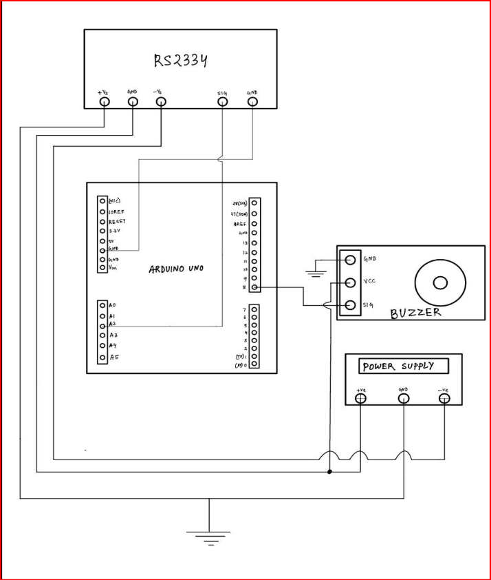

# Real-Time Muscle Fatigue Monitoring using Surface Electromyography (EMG)

A low-cost biomedical instrumentation system for real-time muscle fatigue detection using surface electromyography (EMG), Arduino Uno, and threshold-based signal analysis. The system continuously monitors forearm muscle activity and provides immediate feedback through an alert mechanism when fatigue-related changes are detected.

---

## Project Highlights

* Real-time forearm muscle fatigue monitoring using surface EMG
* RS2334 EMG sensor-based signal acquisition
* Arduino Uno embedded implementation
* Threshold-based fatigue detection algorithm
* Automated buzzer alert generation
* Low-cost wearable biomedical monitoring system
* Applications in rehabilitation engineering and sports performance monitoring
* Demonstrates practical biomedical signal acquisition and processing

---

## Overview

Muscle fatigue is characterized by a reduction in a muscle's ability to generate force during sustained physical activity. Continuous monitoring of muscle activity can provide valuable information for rehabilitation, sports science, ergonomics, and biomedical instrumentation.

This project presents a real-time muscle fatigue monitoring system based on surface electromyography (EMG). The system utilizes an RS2334 EMG sensor to acquire electrical activity from forearm muscles and processes the signals using an Arduino Uno microcontroller. A threshold-based fatigue detection algorithm was implemented to identify fatigue-related changes in muscle activity and trigger an alert through a piezo buzzer.

The proposed system demonstrates a low-cost and portable solution for wearable muscle monitoring applications and provides a foundation for future development of intelligent rehabilitation and performance monitoring systems.

---

## Objectives

* Acquire surface EMG signals from forearm muscles.
* Monitor muscle activity in real time.
* Detect fatigue-related variations in EMG signals.
* Generate an automated alert upon fatigue detection.
* Develop a low-cost biomedical instrumentation platform using Arduino.
* Demonstrate practical implementation of biosignal monitoring systems.

---

## Hardware Components

The system was developed using the following hardware components:

* Arduino Uno
* RS2334 EMG Sensor
* Surface EMG Electrodes
* Piezo Buzzer
* Connecting Wires
* USB Power Supply
* Personal Computer for visualization and monitoring

---

## Circuit Diagram

The complete hardware architecture of the muscle fatigue monitoring system is shown below. The system integrates an RS2334 EMG sensor, Arduino Uno microcontroller, buzzer feedback module, and external power supply for real-time acquisition and processing of electromyographic signals.

<p align="center">
  
</p>

*Figure 1. Circuit diagram of the EMG-based muscle fatigue monitoring system.*

---

## System Architecture

The developed system consists of three major modules:

### 1. Signal Acquisition Module

Surface EMG electrodes placed on the forearm acquire electrical activity generated during muscle contractions. The RS2334 EMG sensor amplifies and conditions these signals for further processing.

### 2. Signal Processing Module

The conditioned EMG signals are transmitted to the Arduino Uno, where signal amplitude and activity levels are continuously monitored using a threshold-based fatigue detection algorithm.

### 3. Alert Module

When fatigue-related signal characteristics exceed predefined thresholds, the system activates a piezo buzzer to provide immediate user feedback.

---

## Methodology

The hardware configuration used in this work is illustrated in Figure 1. Surface EMG signals acquired by the RS2334 sensor are transmitted to the Arduino Uno, where real-time fatigue analysis is performed and user feedback is generated through a buzzer module.

The developed system acquires electrical activity generated during muscle contraction using surface EMG electrodes placed on the forearm. The RS2334 EMG sensor amplifies and conditions the acquired signals before transmitting them to the Arduino Uno for processing.

A threshold-based algorithm continuously analyzes incoming EMG signals to identify sustained changes associated with muscle fatigue. When predefined fatigue conditions are met, the system activates a piezo buzzer to alert the user in real time.

### Experimental Workflow

1. Placement of EMG electrodes on forearm muscles.
2. Acquisition of muscle electrical activity.
3. Signal amplification using RS2334 EMG sensor.
4. Arduino-based signal processing.
5. Threshold-based fatigue analysis.
6. Fatigue condition identification.
7. Buzzer activation and user notification.

---

## Signal Processing

Surface EMG signals were sampled through the analog input of the Arduino Uno. The acquired signals were monitored using the Arduino Serial Plotter to observe variations in muscle activity during contraction and fatigue.

The fatigue detection logic was based on changes in signal amplitude and sustained activation patterns. When the detected activity exceeded predefined thresholds for a specified duration, the system classified the condition as muscle fatigue and triggered an audible alert.

### Detection Strategy

* Continuous signal monitoring
* Threshold-based fatigue classification
* Real-time processing
* Automated feedback generation

---

## Source Code

The Arduino implementation for real-time EMG monitoring and fatigue detection is available in:

```text
emg_fatigue_monitor.ino
```

The code performs:

* EMG signal acquisition
* Threshold analysis
* Fatigue detection
* Buzzer control
* Serial monitoring

---

## Results

The developed system successfully acquired EMG signals from forearm muscles and demonstrated real-time fatigue monitoring capability.

### Key Outcomes

* Successful acquisition of surface EMG signals.
* Real-time monitoring using Arduino Serial Plotter.
* Detection of fatigue-related changes in muscle activity.
* Reliable activation of buzzer alerts under fatigue conditions.
* Demonstration of a low-cost wearable biomedical monitoring solution.

The prototype validated the feasibility of using surface electromyography and embedded systems for practical muscle fatigue assessment applications.

---

## Applications

* Biomedical Instrumentation
* Rehabilitation Engineering
* Sports Performance Monitoring
* Human–Machine Interfaces
* Wearable Health Monitoring
* Muscle Fatigue Assessment
* Occupational Ergonomics
* Physiotherapy and Recovery Monitoring

---

## Limitations

* Single-channel EMG acquisition
* Threshold-based detection rather than machine learning classification
* Sensitivity to electrode placement
* Motion artifact interference
* Limited testing population
* No wireless communication capability

---

## Future Work

Potential future improvements include:

* Wireless data transmission using Bluetooth or Wi-Fi
* Mobile application integration
* Machine learning-based fatigue classification
* Multi-channel EMG acquisition
* Cloud-based monitoring and analytics
* Advanced digital signal processing techniques
* Wearable rehabilitation platform integration
* Long-term physiological monitoring

---

## Repository Structure

```text
muscle-fatigue-monitoring-emg/

├── README.md
├── emg_fatigue_monitor.ino
├── MUSCLE_FATIGUE_MONITORING_SYSTEM_REPORT.pdf
├── circuit_diagram.png
└── LICENSE
```

---

## Team

This project was developed as part of a Biomedical Engineering group project at the National Institute of Technology Rourkela.

### Team Members

* Priyabrata Das (123BM0746)
* Abhiram Gajula (123BM0747)
* Akash Kar (123BM0748)
* Divyanshu Kaushik (123BM0749)
* Tammana Tanmayi (123BM0750)

---

## My Contributions

My specific contributions to the project included:

* Arduino programming and code development
* Surface EMG signal acquisition and monitoring
* Fatigue detection logic implementation
* Hardware integration and system testing
* Experimental validation
* Technical documentation and project reporting

---

## Project Supervisor

Dr. Earu Banoth

Department of Biomedical Engineering

National Institute of Technology Rourkela

---

## Conclusion

This project demonstrates the feasibility of using surface electromyography and embedded systems for real-time muscle fatigue monitoring. By integrating an RS2334 EMG sensor with Arduino-based signal processing, the system successfully acquired muscle activity data, identified fatigue-related signal patterns, and provided immediate user feedback through an alert mechanism.

The work highlights the potential of low-cost biomedical instrumentation systems for applications in rehabilitation engineering, sports science, wearable healthcare, and human performance monitoring.

---

## Repository Maintainer

**Priyabrata Das**

Biomedical Engineering

National Institute of Technology Rourkela

**GitHub:** https://github.com/PriyabrataDas1

**LinkedIn:** https://www.linkedin.com/in/priyabrata-das-74244033b/

---

## Keywords

Surface Electromyography (EMG), Muscle Fatigue Monitoring, Biomedical Instrumentation, Biosignal Processing, Arduino Uno, Embedded Systems, Rehabilitation Engineering, Wearable Health Monitoring, Biomedical Signal Analysis, Real-Time Monitoring, Human–Machine Interface, Sports Performance Monitoring

---

## License

This project is distributed under the MIT License. See the LICENSE file for details.
